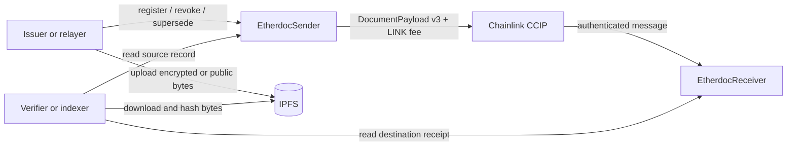

# Etherdoc

Etherdoc is a non-upgradeable smart contract registry for document provenance. It records a
canonical file digest and CIDv1 retrieval reference on a source chain, then replicates that record
to selected destination chains through Chainlink CCIP.

The contracts answer four separate questions:

- do downloaded bytes match the digest registered on-chain?
- which address issued the record, and when?
- is the record currently active, revoked, or superseded?
- did a selected destination chain receive the replicated state?

Etherdoc does not identify the real-world organization behind an address, store document bytes, or
make a document legally authentic by itself.

> [!IMPORTANT]
> Etherdoc is currently a testnet-stage project. It has never been deployed to mainnet, publishes no
> canonical production contract addresses, and should not be treated as independently audited
> production software.

## Start here

| Goal | Entry point |
| --- | --- |
| Build and run the contracts locally | [Quick start](#quick-start) |
| Understand identities, records, and lifecycle | [How Etherdoc works](#how-etherdoc-works) |
| Integrate contract calls and events | [Contracts and public API](#contracts-and-public-api) |
| Review the security boundary | [Trust and verification model](#trust-and-verification-model) |
| Deploy and configure a testnet lane | [Network configuration and deployment](#network-configuration-and-deployment) |
| Operate governance or recover a failed message | [Documentation map](#documentation-map) |
| Contribute and run every quality gate | [Development and testing](#development-and-testing) |

## Architecture



`EtherdocSender` is the canonical registry and outbound CCIP endpoint. `EtherdocReceiver` is a
destination replica that accepts messages only from explicitly trusted
`(sourceChainSelector, sender)` pairs. Registration and dispatch are separate transactions, so one
document version can be sent to several independent destinations without coupling their success.

The repository contains only the smart contracts and their operational tooling. Frontend, backend,
indexer, database, pinning service, and alerting implementations belong in separate repositories.

## Quick start

### Prerequisites

- Git with submodule support;
- Bash;
- `foundryup` to install the pinned Foundry release;
- `jq` for deployment-manifest workflows.

Clone recursively and install the exact toolchain recorded by the repository:

```shell
git clone --recurse-submodules <repository-url>
cd sc-etherdoc

foundryup --install "$(cat .foundry-version)"
forge --version
```

For an existing checkout, synchronize dependencies before building:

```shell
git submodule sync --recursive
git submodule update --init --recursive
```

Build and run the deterministic test suite:

```shell
forge build
forge test -vv
```

Application, script, and test sources use Solidity `0.8.36`, target the Paris EVM, and compile with
the optimizer enabled at 200 runs. Foundry is pinned to `v1.7.1`. Dependency versions and full Git
commits are documented in the [dependency policy](docs/DEPENDENCY_POLICY.md).

## How Etherdoc works

### 1. Prepare content

Hash the exact file bytes with SHA-256 and upload those same bytes through the canonical IPFS
profile. Etherdoc performs no line-ending, Unicode, text-encoding, archive, PDF-metadata, or EXIF
normalization.

Accepted retrieval references are CIDv1, lowercase unpadded base32, without an `ipfs://` prefix:

- `raw` (`0x55`) with a 32-byte SHA2-256 multihash equal to the file digest; or
- `dag-pb` (`0x70`) with an independent 32-byte SHA2-256 DAG-root digest.

Privacy-sensitive documents must be encrypted before upload. The registered digest then commits to
the ciphertext, while encryption keys remain off-chain. Follow the pin-confirmation, retention, and
recovery requirements in the [IPFS and content integrity policy](docs/IPFS_POLICY.md).

### 2. Register a record

An authorized issuer registers directly, or a relayer submits an EIP-712 authorization signed by
the issuer. A record stores:

- the raw-file content digest and canonical CID;
- decoded CID codec and multihash digest;
- an optional `bytes32` metadata commitment;
- issuer, source chain ID, and timestamps;
- schema version, record version, status, and supersession links.

The stable identity is derived from the issuer and exact file bytes:

```solidity
documentId = keccak256(abi.encode(issuer, contentDigest));
```

Changing a filename, MIME type, gateway, or IPFS DAG layout does not change the document ID.
Changing one file byte does, and two issuers can independently attest to the same bytes.

### 3. Dispatch selected state

An operator quotes the LINK fee and dispatches each configured destination separately:

```solidity
uint256 fee = sender.quoteFee(documentId, destinationChainSelector);
bytes32 messageId = sender.dispatchDocument(
    documentId,
    destinationChainSelector,
    maximumFee
);
```

`maximumFee` bounds the race between quoting and mining. A failed lane does not erase successful
lanes, and a router failure writes no dispatch record, so the operator can requote and retry.

### 4. Receive and verify

The destination authenticates the source selector and sender before decoding the payload. A
verifier then:

1. reads the source record or destination receipt;
2. downloads the exact bytes through the recorded CID;
3. calculates SHA-256 locally;
4. calls `verifyDocument(documentId, calculatedDigest)`; and
5. separately evaluates issuer trust and the current lifecycle status.

The EVM cannot download IPFS content, so on-chain verification compares caller-supplied digest data
only.

## Document lifecycle

Every registration starts at version 1 with status `ACTIVE`. An issuer can make exactly one terminal
transition:

```text
REGISTER v1 / ACTIVE
├── REVOKE v2 / REVOKED
└── SUPERSEDE v2 / SUPERSEDED ──> new REGISTER v1 / ACTIVE
```

Revocation increments the version without deleting provenance. Supersession links both the old
terminal record and the new active record. Revoked and superseded records remain queryable and
cannot be reactivated.

Removing an issuer blocks new registration and supersession, but deliberately preserves that
issuer's ability to revoke its historical records. Governance cannot rewrite or revoke another
issuer's record.

Relayed registration, revocation, and supersession use the EIP-712 domain `Etherdoc`, version `2`,
the current chain ID, and the sender address. Each authorization includes an issuer-scoped monotonic
nonce and deadline, and a successful operation consumes the nonce.

## Contracts and public API

| Contract | Responsibility |
| --- | --- |
| `EtherdocSender` | Canonical records, issuer signatures, lifecycle, remote configuration, fee quotes, dispatch history, and LINK treasury recovery |
| `EtherdocReceiver` | Trusted-source authentication, CCIP receipt processing, replay protection, replicated records, and destination verification |
| `EtherdocGovernance` | Two-step ownership and separated operator/pauser role checks |
| `EtherdocTypes` | Shared records, lifecycle operations, canonical CID codec, and compact CCIP payload conversion |

### Common write operations

| Actor | Sender operation | Purpose |
| --- | --- | --- |
| Issuer | `registerDocument(...)` | Register a raw digest, CID, and optional metadata commitment |
| Relayer | `registerDocumentBySig(...)` | Submit an issuer-signed registration |
| Issuer or relayer | `revokeDocument(...)`, `revokeDocumentBySig(...)` | Permanently revoke an active record |
| Issuer or relayer | `supersedeDocument(...)`, `supersedeDocumentBySig(...)` | Link an old record to a replacement |
| Operator | `dispatchDocument(...)` | Send one record version to one configured destination |
| Governance | `configureRemote(...)` | Set the destination receiver and `uint32` callback gas policy |

Receiver governance uses `configureTrustedRemote(...)` to authorize an exact source selector/sender
pair. Pausers can stop registration, dispatch, or receive independently; only governance can
unpause.

### Common reads and integration events

- `getDocument`, `isDocumentRegistered`, `isDocumentActive`, and `verifyDocument` expose source
  state.
- `quoteFee`, `getRemoteConfig`, `getDispatch`, and `getDispatchAtVersion` expose lane and dispatch
  state.
- `getReceipt`, `isDocumentReceived`, `isMessageProcessed`, and `getMessageDocument` expose
  destination evidence.
- `DocumentRegistered` and `DocumentStatusChanged` describe canonical lifecycle changes.
- `MessageSent`, `MessageReceived`, and `MessageIgnored` reconcile asynchronous delivery and replay.

Integrators should index `(documentId, version, destinationChainSelector)`, not only `documentId`.
Source status `DISPATCHED` proves only that the Router accepted a message; destination delivery
requires the receiver event/receipt and CCIP status.

## Roles and emergency controls

| Principal | Authority |
| --- | --- |
| Governance owner | Manage issuers and roles, configure remotes, withdraw treasury tokens, unpause, and initiate two-step ownership transfer |
| Issuer | Register, revoke, or supersede its own records |
| Operator | Dispatch already configured records; fee quotes remain public |
| Pauser | Pause its assigned registration, dispatch, or receive subsystem |
| Relayer | Submit valid issuer signatures without receiving a privileged on-chain role |

Production owners must be reviewed multisig contracts supplied explicitly at deployment. The
deployer receives no implicit governance or issuer authority. Deployment scripts reject a
production network configured with direct EOA governance.

A receive pause deliberately reverts CCIP execution without marking the message processed, allowing
the same message ID to be manually executed after recovery. Registration pause still permits
issuer-authorized revocation. Resume destination receive before source dispatch.

Contracts are intentionally non-upgradeable. Logic or payload changes require new deployments and
explicit remote rotation. See the [governance and emergency pause runbook](docs/GOVERNANCE_RUNBOOK.md)
for role rotation, multisig requirements, and incident recovery.

## Trust and verification model

Etherdoc is an issuer registry, not a legal identity provider. Source governance maintains the
authorized address set; off-chain consumers must map those addresses to real organizations and
decide whether each organization is trusted for the document type.

Verification terms intentionally remain separate:

- **Integrity**: SHA-256 of downloaded bytes equals the stored `contentDigest`.
- **Existence and timestamping**: a record was registered at `registeredAt` on `sourceChainId`.
- **Authenticity**: the source contract accepted the record from an authorized issuer, directly or
  through a valid signature. This is only as strong as the off-chain issuer mapping.
- **Validity**: the current status is `ACTIVE`; terminal records remain queryable but are invalid.
- **Replication**: a trusted receiver accepted a specific source version; this does not create a
  new independent issuer attestation.

`verifyDocument` returns the full record, a digest-match result, and current validity. It does not
collapse integrity, identity trust, legal meaning, and lifecycle into one “authentic” boolean.

## Cross-chain behavior and failure model

CCIP replication is asynchronous and non-atomic. Dispatching to multiple chains is an off-chain
orchestrated workflow with one transaction and one monitor per destination.

Etherdoc uses a fixed 448-byte `DocumentPayload` schema version 3. It transmits provenance once and
represents the CID as compact `(codec, multihashDigest)` metadata. The receiver reconstructs the
canonical CID and document ID deterministically. Older payload schemas are intentionally
incompatible. The exact layout and benchmark are in the [payload schema](docs/PAYLOAD_SCHEMA.md).

Every outbound message uses CCIP 2.0 `GenericExtraArgsV3` with:

- `WAIT_FOR_FINALITY_FLAG`;
- an empty CCV list selecting the default CommitteeVerifier;
- `address(0)` selecting the default executor; and
- a per-remote `uint32` callback gas limit.

Etherdoc does not enable faster-than-finality, custom CCVs, custom executors, token transfers, native
fee payment, or `NO_EXECUTION_TAG`. CCIP execution remains permissionless even with the default
executor, so verified failed messages can be manually executed.

The sender is treasury-funded in LINK and never pulls fees from issuers or relayers. Governance can
recover excess ERC-20 balances, but operators should retain enough LINK for pending dispatches.

The receiver records every successfully handled message ID. Exact redelivery and distinct messages
carrying equal or older record versions are ignored idempotently. Invalid messages revert so CCIP
retains failure evidence and the same message ID can be recovered. After Router acceptance, recover
that message rather than sending a duplicate payload. Follow the
[CCIP recovery runbook](docs/CCIP_RECOVERY_RUNBOOK.md).

## Network configuration and deployment

The checked-in example topology is Mantle Sepolia as source and Ink Sepolia as destination. Router,
LINK, selector, gas, explorer, RPC alias, governance mode, and Directory verification timestamp are
read from [`config/networks/testnet.json`](config/networks/testnet.json); scripts contain no embedded
network addresses.

The example is not a published Etherdoc deployment. CCIP lane support can change, so revalidate both
official Directory entries before a production-like deployment:

- [Mantle Sepolia CCIP configuration](https://docs.chain.link/ccip/directory/testnet/chain/ethereum-testnet-sepolia-mantle-1)
- [Ink Sepolia CCIP configuration](https://docs.chain.link/ccip/directory/testnet/chain/ink-testnet-sepolia)

Record the completed check by updating `directoryVerifiedAt` in the network config.

Copy the environment template and replace every placeholder:

```shell
cp .env-example .env

set -a
source .env
set +a
```

Never commit `.env`, RPC secrets, API keys, plaintext production keys, or signing credentials. Use
an encrypted Foundry account or hardware wallet for broadcasts. Before deployment, set
`GOVERNANCE`, `INITIAL_ISSUER`, `OPERATOR`, and `PAUSER` explicitly. The source constructor uses all
four roles; the destination constructor uses governance and pauser.

Deploy the destination and source separately from a clean, committed worktree:

```shell
NETWORK=inkSepolia RPC_URL="$INK_SEPOLIA_RPC_URL" \
  bash script/deploy-contract.sh receiver --account deployer

NETWORK=mantleSepolia RPC_URL="$MANTLE_SEPOLIA_RPC_URL" \
  bash script/deploy-contract.sh sender --account deployer
```

Then configure both sides of the lane:

```shell
SOURCE_NETWORK=mantleSepolia DESTINATION_NETWORK=inkSepolia CONFIGURE_TARGET=RECEIVER \
  forge script script/ConfigureEtherdocRemotes.s.sol:ConfigureEtherdocRemotesScript \
    --rpc-url ink_sepolia --broadcast --account governance

SOURCE_NETWORK=mantleSepolia DESTINATION_NETWORK=inkSepolia CONFIGURE_TARGET=SENDER \
  forge script script/ConfigureEtherdocRemotes.s.sol:ConfigureEtherdocRemotesScript \
    --rpc-url mantle_sepolia --broadcast --account governance
```

Fund the sender to a target LINK balance before dispatch:

```shell
NETWORK=mantleSepolia TREASURY_ACTION=FUND \
TARGET_LINK_BALANCE="$TARGET_LINK_BALANCE" \
  forge script script/ManageEtherdocTreasury.s.sol:ManageEtherdocTreasuryScript \
    --rpc-url mantle_sepolia --broadcast --account funder
```

Deployment runs create receipt-backed address books and manifests under `deployments/`. Reruns
verify and reuse existing state. Configuration, target-balance funding, and retention-based
withdrawal also become no-ops when the desired state already holds. Production multisig operations
emit Safe Transaction Builder proposals instead of impersonating the owner.

The complete preflight rules, funding, verification, manifest schema, and Safe workflow are in
[Deployment and configuration](docs/DEPLOYMENT.md).

## Development and testing

Run formatting, lint, deterministic tests, CI-strength fuzz/invariants, and repository checks:

```shell
forge fmt --check
forge lint --deny warnings src script test
forge test -vv
FOUNDRY_PROFILE=ci forge test -vv
bash script/check-coverage.sh
bash script/check-contract-sizes.sh
bash script/check-gas-snapshot.sh
bash script/ci-deployment-dry-run.sh
bash script/test-deployment-workflow.sh
```

Coverage enforces 100% line, statement, branch, and function coverage for `src/`. Size budgets remain
below EIP-170/EIP-3860 limits, and gas snapshots use a reviewed tolerance. Ordinary tests are
deterministic and RPC-independent.

Provide both testnet RPC URLs to exercise both directions of the optional fork checks; they never
broadcast:

```shell
MANTLE_SEPOLIA_RPC_URL=<rpc-url> \
INK_SEPOLIA_RPC_URL=<rpc-url> \
  forge test --match-path test/CCIPV2Fork.t.sol -vv
```

Each direction reports a clear skip when its RPC is absent. See [Testing](docs/TESTING.md) for suite
boundaries, Slither, fork behavior, and the protected scheduled testnet E2E workflow.

## Documentation map

| Document | Contents |
| --- | --- |
| [IPFS policy](docs/IPFS_POLICY.md) | CID canonicalization, exact-byte hashing, pinning, privacy, retention, and verifier behavior |
| [Payload schema](docs/PAYLOAD_SCHEMA.md) | Schema-v3 layout, CID reconstruction, compatibility policy, and encoding benchmark |
| [Deployment](docs/DEPLOYMENT.md) | Manifests, remote configuration, LINK treasury, Safe proposals, and explorer verification |
| [Governance runbook](docs/GOVERNANCE_RUNBOOK.md) | Role matrix, multisig policy, rotation, pause, unpause, and redeployment |
| [CCIP recovery runbook](docs/CCIP_RECOVERY_RUNBOOK.md) | Monitoring, failed execution triage, manual execution, and lane recovery |
| [Dependency policy](docs/DEPENDENCY_POLICY.md) | Exact commits, remappings, compiler/toolchain pins, and upgrade gates |
| [Testing](docs/TESTING.md) | Unit, fuzz, invariant, integration, fork, coverage, static analysis, and live E2E strategy |
| [Codebase audit TODO](docs/TODO_CODEBASE_AUDIT.md) | Completed invariants, external integration notes, and future contract work |
